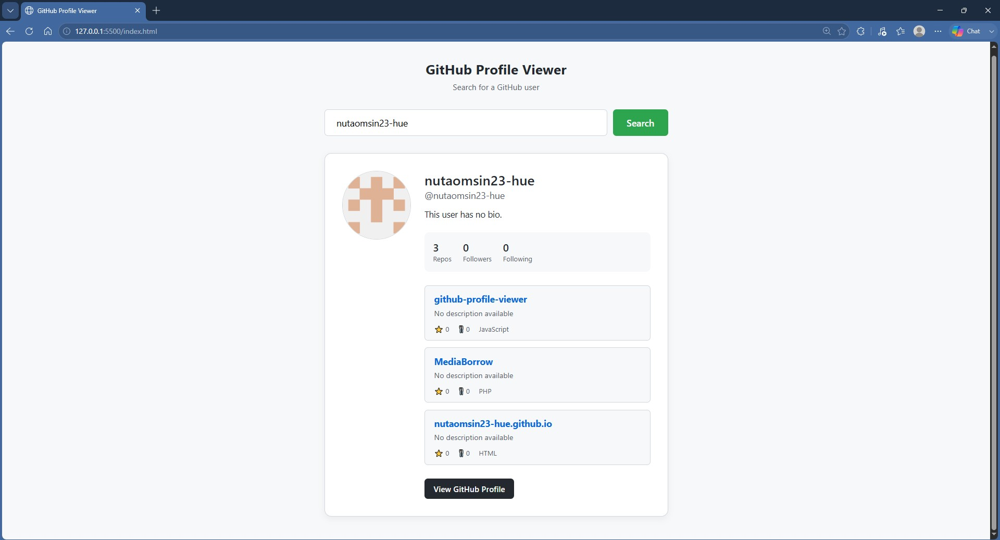

# GitHub Profile Viewer

A responsive and clean web application that allows users to search for GitHub profiles and view their public data using the GitHub REST API. This project was created to demonstrate front-end development skills and API integration.

## 📸 Screenshot
 <!-- เปลี่ยนชื่อไฟล์ภาพให้ตรงกับของคุณ -->

## ✨ Features
- Search for any GitHub user by username.
- View user profile details (Avatar, Name, Bio, Followers, Following, Public Repositories).
- View the 5 most recently updated repositories with details (Stars, Forks, Language).
- Direct links to the user's GitHub profile and their repositories.
- Error handling for invalid usernames or empty inputs.
- Loading states for better user experience.
- Fully responsive design for desktop and mobile devices.
- Press `Enter` to trigger the search.

## 🛠️ Technologies Used
- **HTML5**: Semantic structure.
- **CSS3**: Custom styling, Flexbox layout, Responsive design (Vanilla CSS).
- **JavaScript (ES6+)**: DOM Manipulation, Event Handling, Async/Await.
- **GitHub REST API**: Data fetching via the `fetch()` API.

## 🚀 Live Demo
[Link to your Live Demo] <!-- เดี๋ยวเราจะมาใส่ลิงก์นี้ในขั้นตอนถัดไป -->

## 📂 Project Structure
- `index.html`: The main HTML document.
- `style.css`: The stylesheet for UI and layout.
- `script.js`: The logic for fetching API data and updating the DOM.
